<p align="center">
  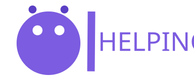
</p>

<h1 align="center">Sobra Zero</h1>
<p align="center">
  Da sobra à mesa de quem precisa · <strong>Squad Lilás</strong><br>
  Projeto de faculdade — construção da UI
</p>

---

## 📌 Proposta do projeto

Todo dia comida boa vai para o lixo — enquanto muita gente passa fome. Restaurantes,
cantinas e mercados descartam excedentes de produção que ainda estão aptos ao consumo,
mas não têm como distribuí-los; instituições sociais precisam desses alimentos e não
têm visibilidade sobre o que sobra onde; voluntários têm vontade de ajudar, mas falta
um combinado seguro de coleta e entrega.

O **Sobra Zero** é a plataforma que conecta esses três lados:

| Perfil | Papel |
|---|---|
| 🍳 **Doador** | Publica a oferta de alimento excedente com quantidade, prazo e local de coleta |
| 🏠 **Instituição** | Aceita a oferta e **confirma** o recebimento |
| 🚗 **Voluntário** | Assume o transporte com as condições declaradas (frio, prazo) |

Cada doação nasce com **validade**, passa por **rastro** e só termina quando quem
recebe confirma — nada de alimento órfão, dado falso ou entrega nunca concluída.

## Objetivo

> Construir a interface completa (UI) da plataforma Sobra Zero, em **desktop (1440)**
> e **mobile (390)**, cobrindo as 7 telas essenciais do produto, menus navegáveis,
> protótipo clicável e a landing de apresentação — pronta para a etapa de
> desenvolvimento (código) do semestre.

Objetivos específicos:

- [x] Design system próprio (cores, tipografia, componentes)
- [x] 9 telas desktop + 7 telas mobile + menu lateral (drawer)
- [x] Protótipo navegável nos dois breakpoints (fluxos de entrada por breakpoint)
- [x] 8 regras de negócio (RN-01 → RN-08) refletidas na interface
- [x] Landing com hero + páginas de login, criação de usuário e termos de uso
- [x] Exportação da estrutura (SVG + PNG + `structure.json`) para a pasta do projeto

## Imagens e logo

<p align="center">
  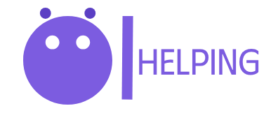
</p>

**Identidade:** roxo `#7C5CE0` / `#5B3FC4`, fundo `#F5F4FA`, tinta `#111827`;
fontes **Phudu** (logo/títulos) e **IBM Plex Sans** (interface).

### Telas — desktop 1440

| | |
|:---:|:---:|
| 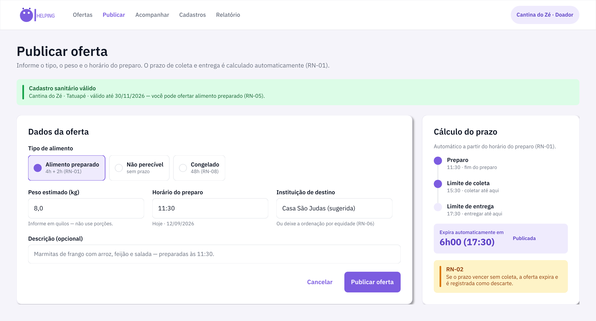 | 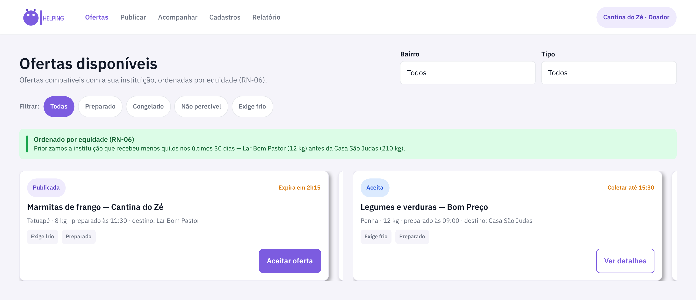 |
| **04 · Publicar oferta** | **05 · Ofertas disponíveis** |
| 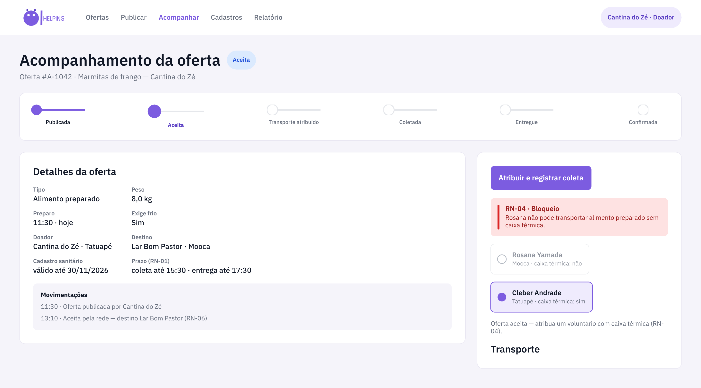 | 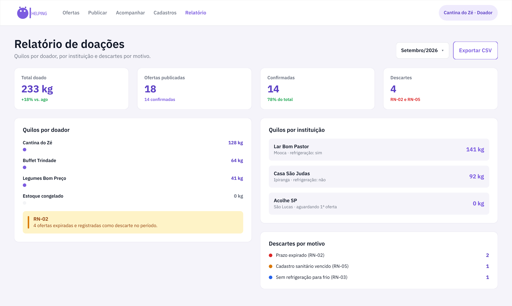 |
| **06 · Acompanhar — Aceita** | **12 · Relatório de doações** |

<details>
<summary>Outras telas desktop (07–11)</summary>

| | |
|:---:|:---:|
| 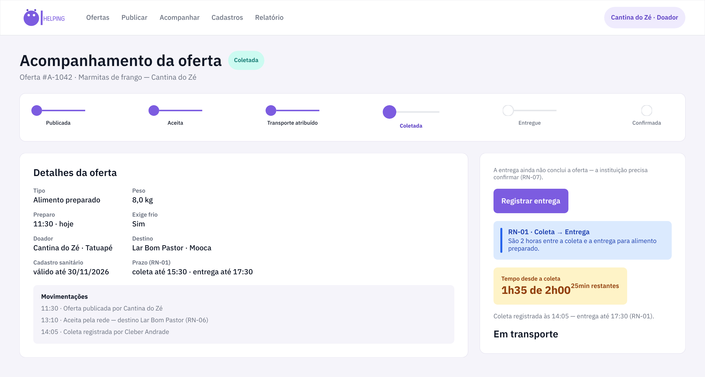 | 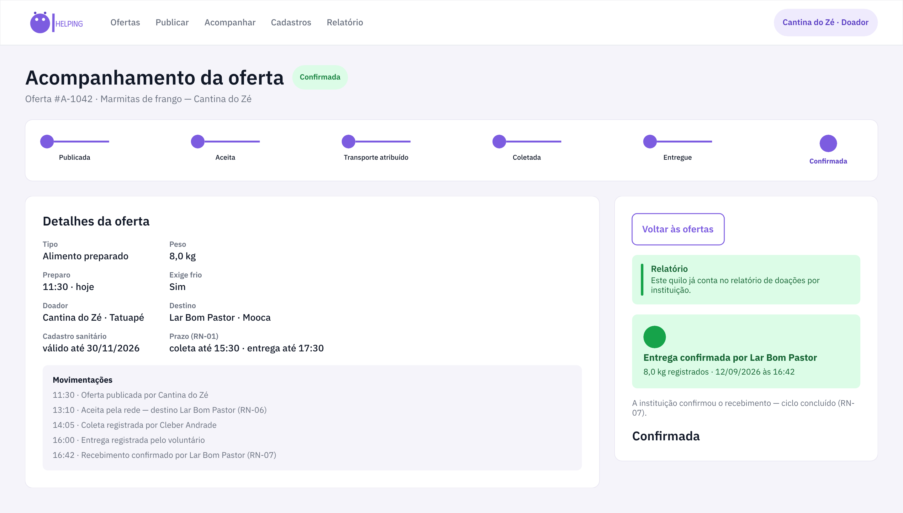 |
| **07 · Coletada** | **08 · Confirmada** |
| 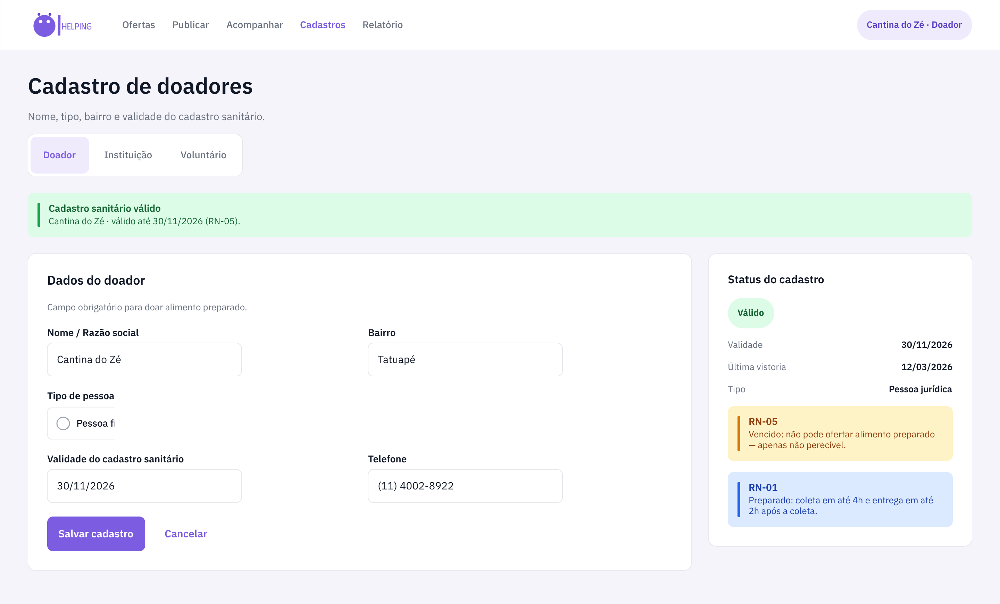 | 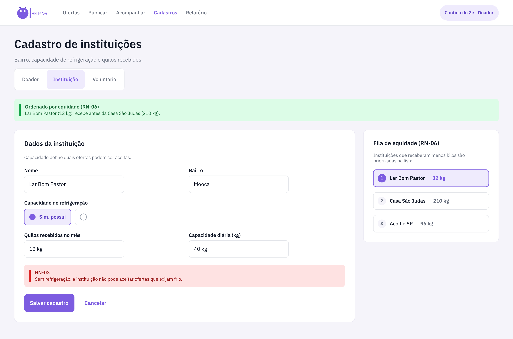 |
| **09 · Cadastro doadores** | **10 · Cadastro instituições** |
| 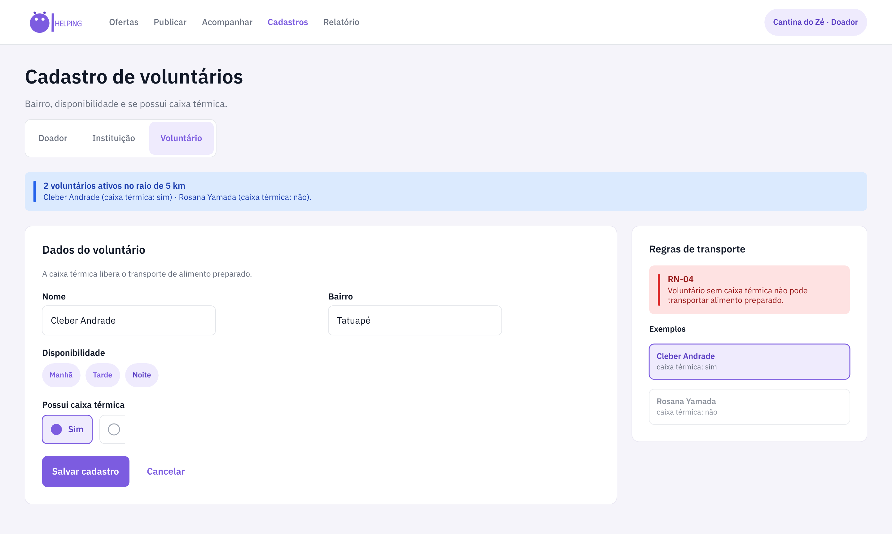 | |
| **11 · Cadastro voluntários** | |

</details>

### Telas — mobile 390

<table>
  <tr>
    <td align="center">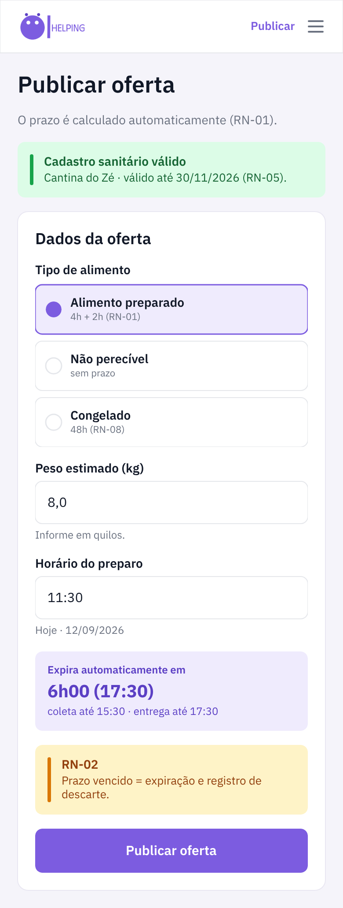<br><b>M1</b> Publicar</td>
    <td align="center">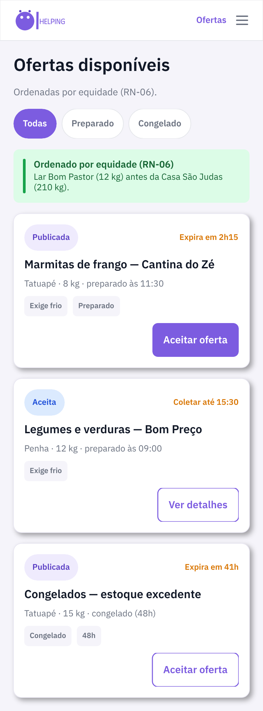<br><b>M2</b> Ofertas</td>
    <td align="center">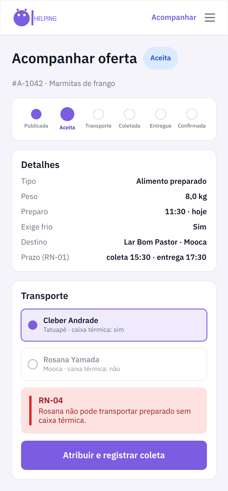<br><b>M3</b> Acompanhar</td>
    <td align="center">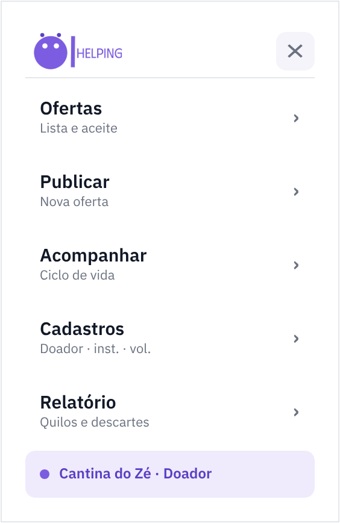<br><b>Menu</b> Drawer</td>
  </tr>
  <tr>
    <td align="center">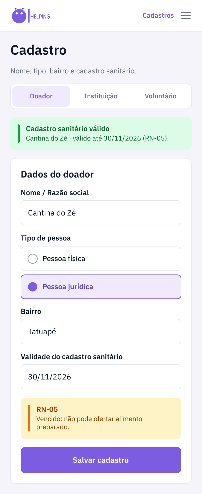<br><b>M4</b> Doador</td>
    <td align="center">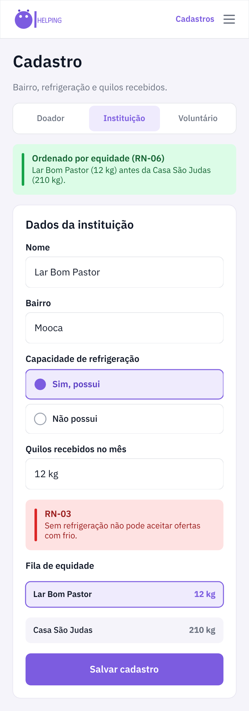<br><b>M5</b> Instituição</td>
    <td align="center">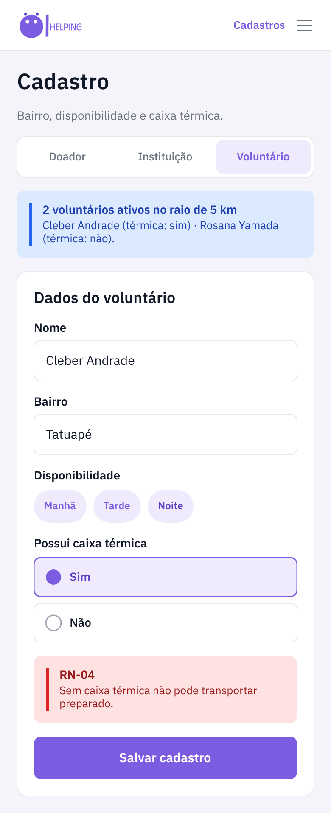<br><b>M6</b> Voluntário</td>
    <td align="center">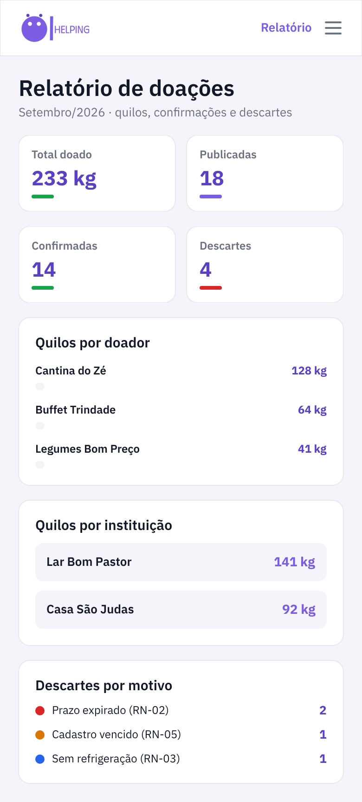<br><b>M7</b> Relatório</td>
  </tr>
</table>

### Landing e páginas de acesso

- `index.html` — hero do projeto, ciclo em 6 etapas, personas, galeria das telas e as 8 RNs
- `pages/login.html` — tela de entrada (doador / instituição / voluntário)
- `pages/cadastro.html` — criação de usuário com abas de perfil
- `pages/termos.html` — termos de uso em 9 cláusulas

>  **Estado atual:** ainda **não existem links externos nem backend** — esta é
> apenas a construção da UI. Login e cadastro são maquetes estáticas (nenhum dado
> é enviado) e apontam de volta para a landing.

##  Estrutura da pasta

```
Lilas_Helpig/
├── index.html              # landing (hero + seções)
├── css/
│   └── stily.css           # design system completo (tokens + componentes)
├── pages/
│   ├── login.html          # entrar
│   ├── cadastro.html       # criar usuário (3 perfis)
│   └── termos.html         # termos de uso
├── design/
│   ├── desktop/            # 9 telas × SVG + PNG @2x
│   ├── mobile/             # 7 telas + drawer × SVG + PNG @2x
│   └── structure.json      # tokens, telas, fluxos e mapa de interações
├── imags/Logo/             # logo (SVG e WebP)
```

##  Regras de negócio na interface

| Regra | Resumo |
|---|---|
| RN-01 | Preparado: 4h do preparo à coleta, 2h da coleta à entrega |
| RN-02 | Oferta fora do prazo expira sozinha e vira descarte registrado |
| RN-03 | Instituição sem refrigeração não aceita oferta que exija frio |
| RN-04 | Voluntário sem caixa térmica não transporta alimento |
| RN-05 | Cadastro sanitário vencido só oferta não perecível |
| RN-06 | Feed prioriza quem recebeu menos kg nos últimos 30 dias |
| RN-07 | Entrega só conclui com confirmação da instituição |
| RN-08 | Congelado não é preparado: prazo de 48h |

**Ciclo de vida da oferta:** Publicada → Aceita → Transporte atribuído → Coletada →
Entregue → Confirmada.

##  Como abrir

Basta abrir o `index.html` no navegador (HTML/CSS/JS puro, sem build).
As imagens vêm da pasta `design/` e o logo de `imags/Logo/`.

##  Licença e contexto

Projeto acadêmico do semestre — **Squad Lilás**. Design original no Penpot,
exportado para SVG/PNG nesta pasta.
