<p align="center">
  
</p>

<h1 align="center">Sobra Zero</h1>
<p align="center">
  Da sobra à mesa de quem precisa · <strong>Squad Lilás</strong><br>
  Projeto de faculdade — Cruzeiro do Sul
</p>

---

## Proposta do projeto

Todo dia comida boa vai para o lixo enquanto muita gente passa fome. Restaurantes,
cantinas e mercados descartam excedentes de produção que ainda estão aptos ao consumo,
mas não têm como distribuí-los; instituições sociais precisam desses alimentos e não
têm visibilidade sobre o que sobra onde; voluntários têm vontade de ajudar, mas falta
um combinado seguro de coleta e entrega.

O **Sobra Zero** é a plataforma que conecta esses três lados:

| Perfil | Papel |
|---|---|
| **Doador** | Publica a oferta de alimento excedente com quantidade, prazo e local de coleta |
| **Instituição** | Aceita a oferta e **confirma** o recebimento |
| **Voluntário** | Assume o transporte com as condições declaradas (frio, prazo) |

Cada doação nasce com **validade**, passa por **rastro** e só termina quando quem
recebe confirma — nada de alimento órfão, dado falso ou entrega nunca concluída.

## Objetivo

> Construir a interface completa (UI) da plataforma Sobra Zero, em **desktop (1440)**
> e **mobile (390)**, cobrindo as 7 telas essenciais do produto, menus navegáveis,
> protótipo clicável e a landing de apresentação — pronta para a etapa de
> desenvolvimento (código) do semestre.

Objetivos específicos:

- [x] Design system próprio (cores, tipografia, componentes)
- [x] 9 telas desktop + 7 telas mobile + menu lateral (drawer)
- [x] Protótipo navegável nos dois breakpoints (fluxos de entrada por breakpoint)
- [x] 8 regras de negócio (RN-01 → RN-08) refletidas na interface
- [x] Landing com hero + páginas de login, criação de usuário e termos de uso
- [x] Exportação da estrutura (SVG + PNG + `structure.json`) para a pasta do projeto

## Imagens e logo

<p align="center">
  
</p>

**Identidade:** roxo `#7C5CE0` / `#5B3FC4`, fundo `#F5F4FA`, tinta `#111827`;
fontes **Phudu** (logo/títulos) e **IBM Plex Sans** (interface).

### Telas — desktop 1440

| | |
|:---:|:---:|
| 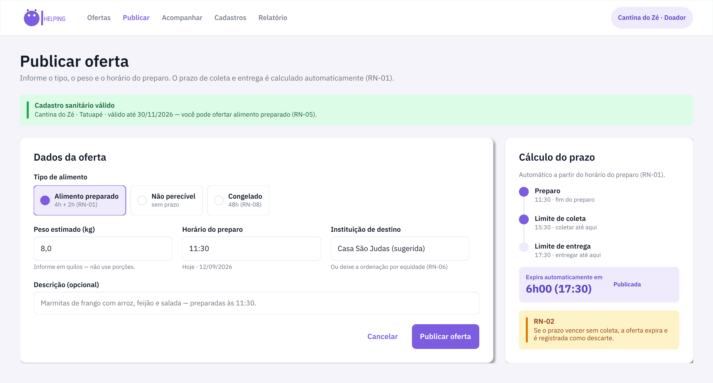 | 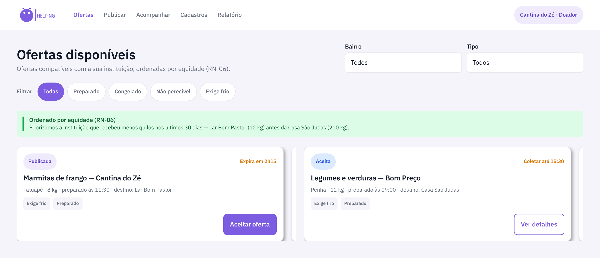 |
| **04 · Publicar oferta** | **05 · Ofertas disponíveis** |
| 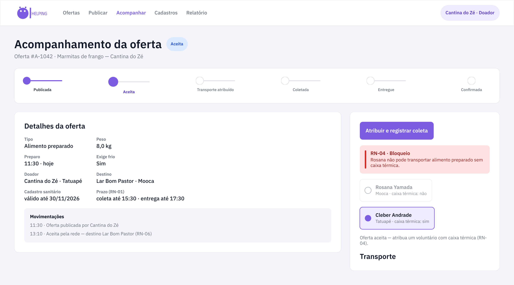 | 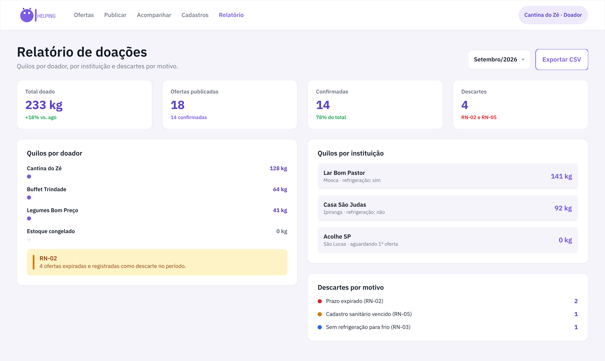 |
| **06 · Acompanhar — Aceita** | **12 · Relatório de doações** |

<details>
<summary>Outras telas desktop (07–11)</summary>

| | |
|:---:|:---:|
| 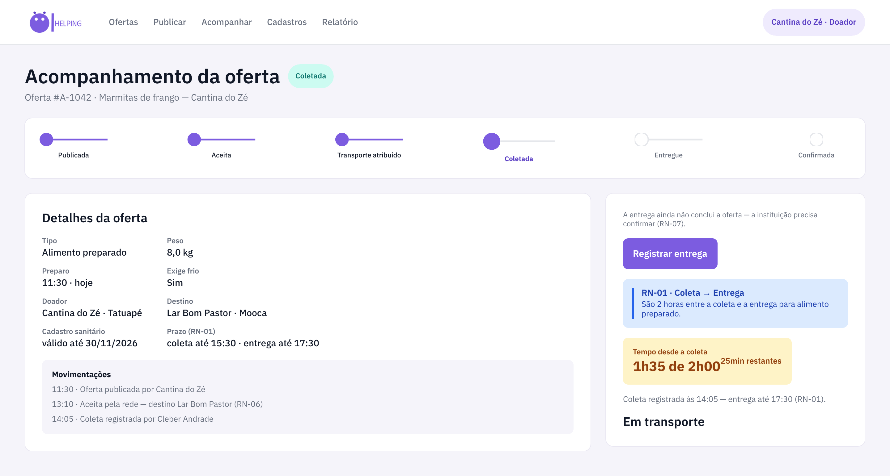 | 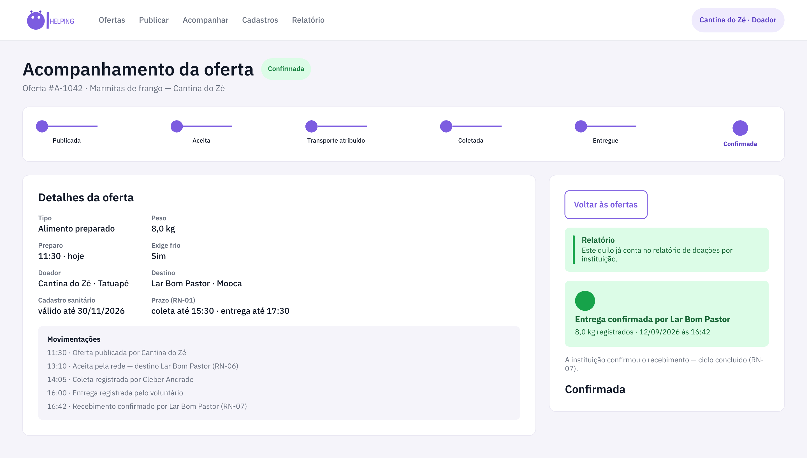 |
| **07 · Coletada** | **08 · Confirmada** |
| 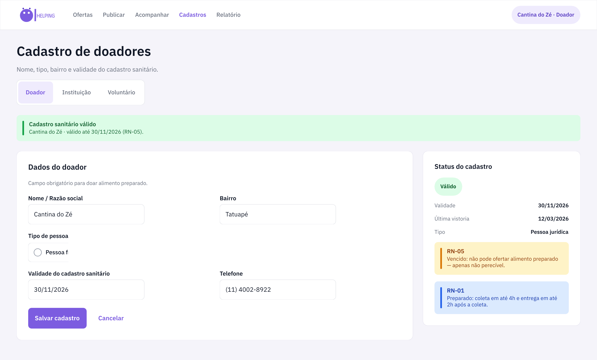 | 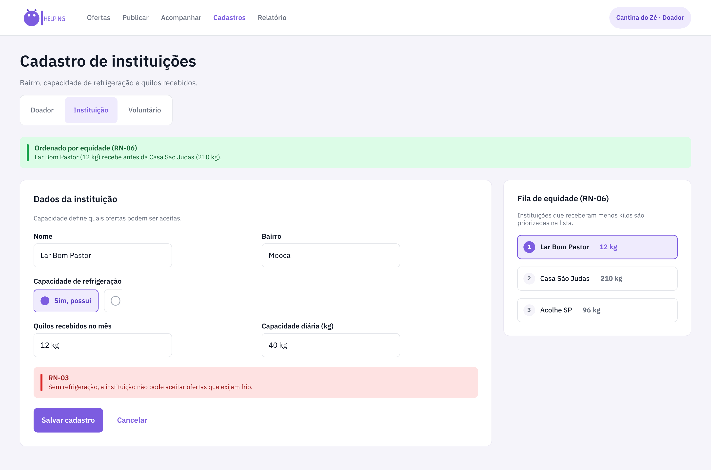 |
| **09 · Cadastro doadores** | **10 · Cadastro instituições** |
| 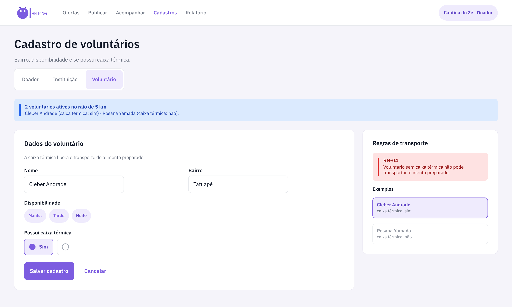 | |
| **11 · Cadastro voluntários** | |

</details>

### Telas — mobile 390

<table>
  <tr>
    <td align="center">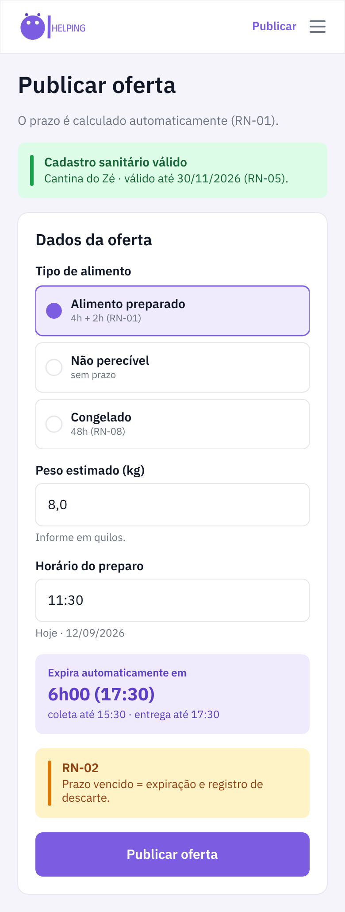<br><b>M1</b> Publicar</td>
    <td align="center">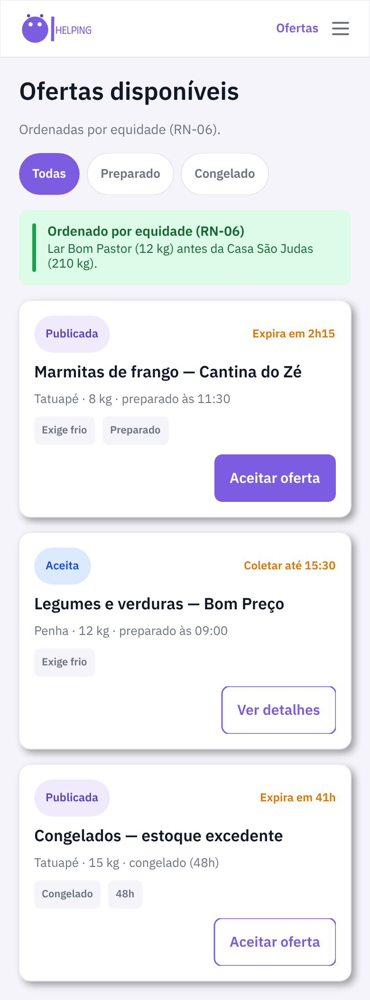<br><b>M2</b> Ofertas</td>
    <td align="center">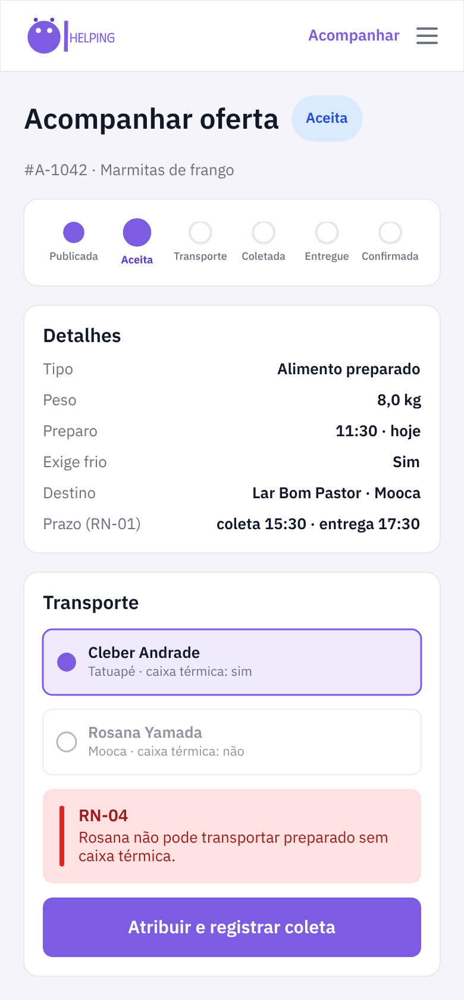<br><b>M3</b> Acompanhar</td>
    <td align="center">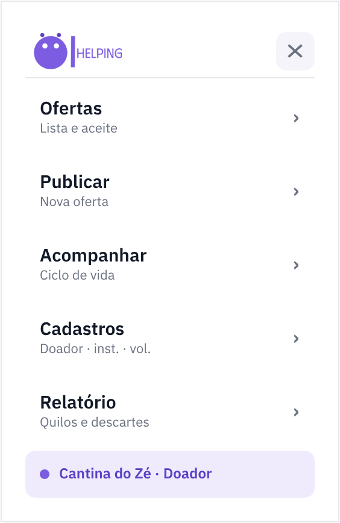<br><b>Menu</b> Drawer</td>
  </tr>
  <tr>
    <td align="center">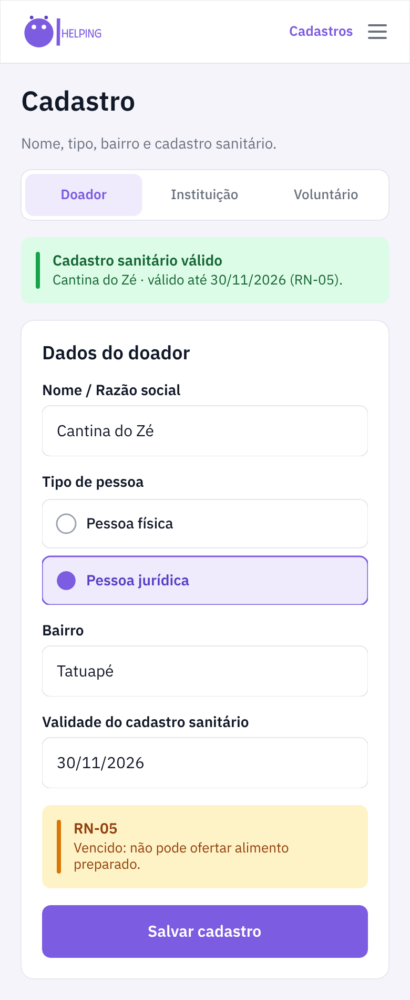<br><b>M4</b> Doador</td>
    <td align="center">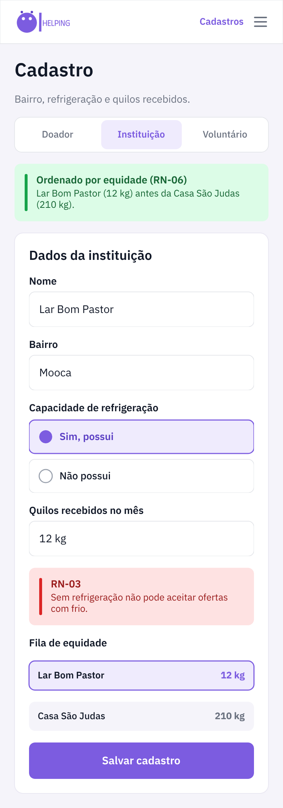<br><b>M5</b> Instituição</td>
    <td align="center">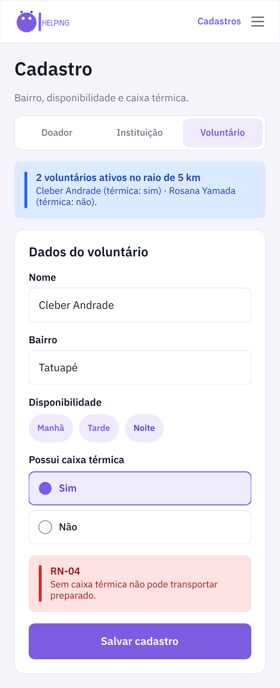<br><b>M6</b> Voluntário</td>
    <td align="center">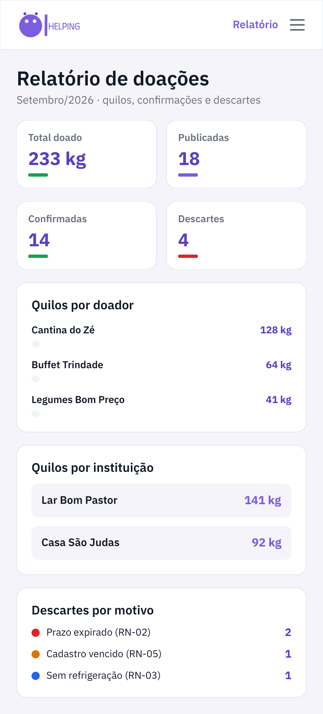<br><b>M7</b> Relatório</td>
  </tr>
</table>

### Landing, acesso e app

- `index.html` — hero do projeto, ciclo em 6 etapas, personas, galeria das telas e as 8 RNs
- `pages/login.html` — entrada real via `supabase.auth.signInWithPassword` + redirect por `user_type`
- `pages/cadastro.html` — `signUp` + insert em doadores/instituições/voluntários (abas de perfil)
- `pages/termos.html` — termos de uso em 9 cláusulas (conteúdo fixo)
- `pages/ofertas.html` — feed via `vw_ofertas_feed`, ordenado por equidade RN-06
- `pages/publicar-oferta.html` — formulário doador → RPC `criar_oferta` (RN-01/05/08)
- `pages/oferta.html?id=...` — timeline (`oferta_historico`) + ações do ciclo (RN-01 a RN-07)
- `pages/relatorio.html` — KPIs via `vw_kpis_gerais` + tabelas de doadores e descartes

> **Estado atual:** backend Supabase ativo. Login, cadastro, feed, publicação,
> ciclo e relatório falam com o banco real via `pages-js/` + RLS + RPCs.

## Estrutura da pasta

```
Lilas_Helpig/
├── index.html              # landing (hero + seções)
├── css/
│   └── stily.css           # design system completo (tokens + componentes)
├── pages/
│   ├── login.html          # entrar (Supabase Auth)
│   ├── cadastro.html       # criar usuário (3 perfis)
│   ├── termos.html         # termos de uso
│   ├── ofertas.html        # feed (tela 05 / M2)
│   ├── publicar-oferta.html# publicar (tela 04 / M1)
│   ├── oferta.html         # acompanhar (telas 06/07/08)
│   └── relatorio.html      # relatório (tela 12 / M7)
├── pages-js/               # frontend JS (ES modules, sem build)
│   ├── supabase.js         # cliente centralizado + helpers de auth/UI
│   ├── login.js            # signInWithPassword + redirect por perfil
│   ├── cadastro.js         # signUp + insert na tabela de detalhe
│   ├── publicar-oferta.js  # RPC criar_oferta (RN-01/05/08)
│   ├── ofertas.js          # feed ordenado por equidade (RN-06)
│   ├── oferta.js           # timeline + avançar ciclo (RN-01 a RN-07)
│   └── relatorio.js        # KPIs + tabelas (RN-02/06/07)
├── supabase/
│   ├── config.toml         # config local da CLI
│   ├── functions/          # Edge Functions (vazio por enquanto)
│   └── migrations/         # 4 migrations SQL (espelho de plano/migrations/)
├── plano/                  # documentação do plano de implementação
│   ├── README.md           # índice navegável + mapa de RNs
│   ├── 01-supabase-setup.md … 06-migrating-from-static.md
│   ├── migrations/         # fonte das migrations
│   └── pages-js/           # fonte dos JS
├── design/
│   ├── Logo/               # logo (SVG e WebP)
│   ├── desktop/            # 9 telas × SVG + PNG @2x
│   ├── mobile/             # 7 telas + drawer × SVG + PNG @2x
│   └── structure.json      # tokens, telas, fluxos e mapa de interações
├── .env.example            # modelo de variáveis
└── .env.local              # URL + keys reais (NÃO commitar)
```

## Backend Supabase

### Diagrama de relacionamentos

```
auth.users (Supabase Auth)
    | 1:1
    v
profiles (id, user_type, nome, email)
    | user_type
    +--> doadores      (1:1 via profile_id)
    +--> instituicoes  (1:1 via profile_id)
    +--> voluntarios   (1:1 via profile_id)

ofertas (doador_id, instituicao_id, voluntario_id)
    +--> oferta_historico  (1:N via oferta_id)
    +--> recebimentos      (1:1 via oferta_id)
```

Todo avanço de status passa por RPC (`criar_oferta`, `aceitar_oferta`,
`assumir_transporte`, `avancar_status`, `confirmar_recebimento`); expiração
automática via `fn_expirar_ofertas()` + `pg_cron` a cada 15 min.

Detalhes em `plano/`: `02-database-schema.md` (schema), `04-rls-policies.md`
(RLS), `05-jobs-functions.md` (triggers/jobs), `01-supabase-setup.md` (setup).

### Tabelas

<details>
<summary><b>profiles</b> — espelho 1:1 de <code>auth.users</code></summary>

<table>
<tr><th>Coluna</th><th>Tipo</th><th>Regra</th></tr>
<tr><td><code>id</code></td><td>uuid (PK, FK auth.users)</td><td>igual ao <code>auth.uid()</code></td></tr>
<tr><td><code>user_type</code></td><td>enum: doador, instituicao, voluntario</td><td>define a tabela de detalhe</td></tr>
<tr><td><code>nome</code></td><td>text (min 2 chars)</td><td>—</td></tr>
<tr><td><code>email</code></td><td>text</td><td>cópia do Auth</td></tr>
<tr><td><code>telefone</code> / <code>avatar_url</code></td><td>text, null</td><td>—</td></tr>
<tr><td><code>termos_aceitos_em</code></td><td>timestamptz, default now()</td><td>—</td></tr>
</table>
</details>

<details>
<summary><b>doadores</b> — perfil estendido do doador (RN-05)</summary>

<table>
<tr><th>Coluna</th><th>Tipo</th><th>Regra</th></tr>
<tr><td><code>id</code></td><td>uuid (PK)</td><td>—</td></tr>
<tr><td><code>profile_id</code></td><td>uuid (UNIQUE, FK profiles)</td><td>—</td></tr>
<tr><td><code>nome_estabelecimento</code></td><td>text</td><td>—</td></tr>
<tr><td><code>responsavel</code></td><td>text</td><td>—</td></tr>
<tr><td><code>cadastro_sanitario_validade</code></td><td>date</td><td><b>RN-05:</b> vencido, só <code>nao_perecivel</code></td></tr>
<tr><td><code>endereco</code> / <code>bairro</code></td><td>text, null</td><td>—</td></tr>
</table>
</details>

<details>
<summary><b>instituicoes</b> — perfil estendido da instituição (RN-03)</summary>

<table>
<tr><th>Coluna</th><th>Tipo</th><th>Regra</th></tr>
<tr><td><code>id</code></td><td>uuid (PK)</td><td>—</td></tr>
<tr><td><code>profile_id</code></td><td>uuid (UNIQUE, FK profiles)</td><td>—</td></tr>
<tr><td><code>razao_social</code> / <code>responsavel_legal</code></td><td>text</td><td>—</td></tr>
<tr><td><code>cnpj</code></td><td>text (UNIQUE, 14 dígitos)</td><td>formato validado no banco</td></tr>
<tr><td><code>tem_refrigeracao</code></td><td>boolean, default false</td><td><b>RN-03:</b> sem frio, não aceita oferta fria</td></tr>
<tr><td><code>capacidade_refrigeracao_kg</code></td><td>numeric(10,2), null</td><td>—</td></tr>
<tr><td><code>necessidade_semanal</code></td><td>enum faixa_necessidade</td><td>informativa</td></tr>
<tr><td><code>aceita_congelado</code></td><td>boolean, default false</td><td>—</td></tr>
</table>
</details>

<details>
<summary><b>voluntarios</b> — perfil estendido do voluntário (RN-04)</summary>

<table>
<tr><th>Coluna</th><th>Tipo</th><th>Regra</th></tr>
<tr><td><code>id</code></td><td>uuid (PK)</td><td>—</td></tr>
<tr><td><code>profile_id</code></td><td>uuid (UNIQUE, FK profiles)</td><td>—</td></tr>
<tr><td><code>nome_completo</code> / <code>telefone</code></td><td>text</td><td>—</td></tr>
<tr><td><code>tem_caixa_termica</code></td><td>boolean, default false</td><td><b>RN-04:</b> sem caixa, não transporta frio</td></tr>
<tr><td><code>meio_transporte</code></td><td>enum meio_transporte</td><td>—</td></tr>
<tr><td><code>capacidade_kg</code> / <code>raio_atuacao_km</code></td><td>numeric / integer, null</td><td>—</td></tr>
<tr><td><code>disponivel</code></td><td>boolean, default true</td><td>pausa sem perder histórico</td></tr>
</table>
</details>

<details>
<summary><b>ofertas</b> — núcleo do produto (RN-01, RN-02, RN-08)</summary>

<table>
<tr><th>Coluna</th><th>Tipo</th><th>Regra</th></tr>
<tr><td><code>id</code></td><td>uuid (PK)</td><td>—</td></tr>
<tr><td><code>doador_id</code></td><td>uuid (FK doadores, RESTRICT)</td><td>fixo após criação</td></tr>
<tr><td><code>titulo</code></td><td>text (3–120 chars)</td><td>—</td></tr>
<tr><td><code>tipo_alimento</code></td><td>enum: preparado, nao_perecivel, frio, congelado</td><td>define prazo e frio</td></tr>
<tr><td><code>exige_frio</code></td><td>boolean gerado</td><td>true para frio/congelado</td></tr>
<tr><td><code>quantidade_kg</code></td><td>numeric (0–5000)</td><td>—</td></tr>
<tr><td><code>data_preparo</code></td><td>timestamptz</td><td>base dos prazos</td></tr>
<tr><td><code>prazo_coleta</code> / <code>prazo_entrega</code> / <code>expira_em</code></td><td>timestamptz</td><td><b>RN-01/RN-08:</b> calculado no banco</td></tr>
<tr><td><code>status</code></td><td>enum status_oferta</td><td>ciclo publicada → confirmada</td></tr>
<tr><td><code>instituicao_id</code> / <code>voluntario_id</code></td><td>uuid (FK, null)</td><td>preenchidos no aceite/transporte</td></tr>
<tr><td><code>motivo_descarte</code> / <code>expirada_em</code> / <code>descartada_em</code></td><td>text / timestamptz</td><td><b>RN-02</b></td></tr>
</table>
</details>

<details>
<summary><b>oferta_historico</b> — timeline append-only</summary>

<table>
<tr><th>Coluna</th><th>Tipo</th><th>Regra</th></tr>
<tr><td><code>oferta_id</code></td><td>uuid (FK ofertas, CASCADE)</td><td>—</td></tr>
<tr><td><code>status_anterior</code> / <code>status_novo</code></td><td>enum status_oferta</td><td>anterior NULL só na criação</td></tr>
<tr><td><code>ator_id</code> / <code>ator_tipo</code></td><td>uuid / enum user_type</td><td>NULL = evento automático</td></tr>
<tr><td><code>comentario</code></td><td>text, null</td><td>—</td></tr>
</table>
</details>

<details>
<summary><b>recebimentos</b> — prova de entrega (RN-07)</summary>

<table>
<tr><th>Coluna</th><th>Tipo</th><th>Regra</th></tr>
<tr><td><code>oferta_id</code></td><td>uuid (UNIQUE, FK ofertas)</td><td>uma oferta, um recebimento</td></tr>
<tr><td><code>instituicao_id</code></td><td>uuid (FK instituicoes)</td><td>só a dona confirma</td></tr>
<tr><td><code>confirmado_por</code></td><td>uuid (FK profiles)</td><td>quem clicou confirmar</td></tr>
<tr><td><code>quantidade_recebida_kg</code></td><td>numeric (&gt; 0)</td><td>peso efetivo</td></tr>
</table>
</details>

### Views

| View | Uso |
|---|---|
| `vw_ofertas_feed` | feed da tela 05 + coluna de prioridade de equidade |
| `vw_equidade_instituicoes` | kg recebidos por instituição em 30 dias (**RN-06**) |
| `vw_descartes` | ofertas expiradas/descartadas com motivo (**RN-02**) |
| `vw_relatorio_doadores` | kg doados × descartes por doador (tela 12) |
| `vw_kpis_gerais` | cards de totais da tela 12 |

### Consultando via JavaScript

```js
import supabase from './pages-js/supabase.js';

// Feed ordenado por equidade (RN-06)
const { data: ofertas } = await supabase
  .from('vw_ofertas_feed')
  .select('*')
  .order('kg_recebidos_30d_prioridade', { ascending: true });

// Publicar oferta (prazos calculados no banco — RN-01/RN-08)
const { data: oferta } = await supabase.rpc('criar_oferta', {
  p_titulo: 'Marmitas de frango',
  p_tipo: 'preparado',
  p_quantidade_kg: 8.5,
  p_data_preparo: new Date().toISOString(),
  p_endereco_coleta: 'Rua X, 123',
});

// Instituição aceita (RN-03 validada no banco)
await supabase.rpc('aceitar_oferta', { p_oferta_id: oferta.id });

// Instituição confirma recebimento (RN-07)
await supabase.rpc('confirmar_recebimento', {
  p_oferta_id: oferta.id,
  p_quantidade_recebida_kg: 7.8,
});
```

##  Regras de negócio na interface

| Regra | Resumo |
|---|---|
| RN-01 | Preparado: 4h do preparo à coleta, 2h da coleta à entrega |
| RN-02 | Oferta fora do prazo expira sozinha e vira descarte registrado |
| RN-03 | Instituição sem refrigeração não aceita oferta que exija frio |
| RN-04 | Voluntário sem caixa térmica não transporta alimento |
| RN-05 | Cadastro sanitário vencido só oferta não perecível |
| RN-06 | Feed prioriza quem recebeu menos kg nos últimos 30 dias |
| RN-07 | Entrega só conclui com confirmação da instituição |
| RN-08 | Congelado não é preparado: prazo de 48h |

**Ciclo de vida da oferta:** Publicada → Aceita → Transporte atribuído → Coletada →
Entregue → Confirmada.

## Como rodar

**Frontend (sem build):** basta abrir o `index.html` no navegador ou servir a
pasta (ex.: `python3 -m http.server 5500`). As páginas do app exigem login:
`pages/cadastro.html` → `pages/login.html` → `pages/ofertas.html`.
A chave usada no browser é a **publishable** (`pages-js/supabase.js`);
nunca exponha a `SECRET_KEY` no frontend.

**Backend (Supabase):**

```bash
npm install -g supabase
supabase login
supabase link --project-ref SEU_REF   # prefixo da URL https://SEU_REF.supabase.co
supabase db push                      # aplica as 4 migrations de supabase/migrations/
```

Sem CLI, rode os 4 arquivos de `supabase/migrations/` na ordem no SQL Editor
e habilite `pg_cron` em Database → Extensions (expiração RN-02).

Variáveis: copie `.env.example` para `.env.local` e preencha
`NEXT_PUBLIC_SUPABASE_URL` + `NEXT_PUBLIC_SUPABASE_ANON_KEY` (publishable key).

##  Licença e contexto

Projeto acadêmico do semestre — **Squad Lilás**. Design original no Penpot,
exportado para SVG/PNG nesta pasta.
